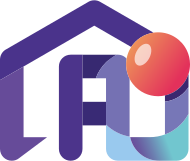

# AyudaHogar: Encuentra servicios para el hogar de confianza en Chile

**¡Conectamos hogares con proveedores de servicios confiables!**

## Descripción

AyudaHogar es una plataforma web diseñada para simplificar la búsqueda y contratación de servicios para el hogar en Chile. Conectamos a usuarios que necesitan servicios con proveedores calificados y confiables. Encuentra fácilmente profesionales para limpieza, reparaciones, jardinería y mucho más. Lee reseñas de otros usuarios, compara servicios y programa citas según tu conveniencia.

## Características Principales

*   **Búsqueda sencilla:** Encuentra proveedores por categoría de servicio (limpieza, reparación, etc.) y ubicación (comuna).
*   **Perfiles detallados de proveedores:** Accede a información completa sobre cada proveedor, incluyendo su experiencia, habilidades, fotos y reseñas de clientes anteriores.
*   **Sistema de reseñas y calificaciones:** Toma decisiones informadas basadas en las experiencias de otros usuarios. Califica a los proveedores y deja comentarios sobre los servicios recibidos.
*   **Gestión de citas:** Programa citas con proveedores según su disponibilidad horaria, simplificando la coordinación.
*   **Autenticación segura:** Inicia sesión de forma segura con tu cuenta de Google para proteger tu información personal.
*   **Interfaz amigable:** Nuestro diseño intuitivo facilita la navegación y la búsqueda de servicios.

## Tecnologías Utilizadas

*   **Backend:** ASP.NET Core con .NET 8 
*   **Frontend:** HTML, CSS y Bootstrap 
*   **Base de datos:** Azure SQL Server 
*   **Autenticación:** Azure Active Directory B2C 
*   **Almacenamiento:** Azure Blob Storage (para fotos de perfil y reseñas) 
*   **Analítica:** Google Analytics 

## Consideraciones Importantes

> [!IMPORTANT]
> Este repositorio es parte de un proyecto académico y no se encuentra en desarrollo activo. Si bien se puede descargar el código fuente, ten en cuenta que la aplicación depende de servicios de Azure como Azure App Service, Azure SQL Database, Azure AD B2C y Azure Blob Storage. 

> [!WARNING]
> Para ejecutar la aplicación localmente, deberás configurar estos servicios por tu cuenta, incluyendo la creación de los recursos necesarios y la configuración de las cadenas de conexión en el código fuente.

## Licencia

Este proyecto está bajo la Licencia MIT.

 

**¡Gracias por visitar el repositorio de AyudaHogar!**

---

## Badges

       
